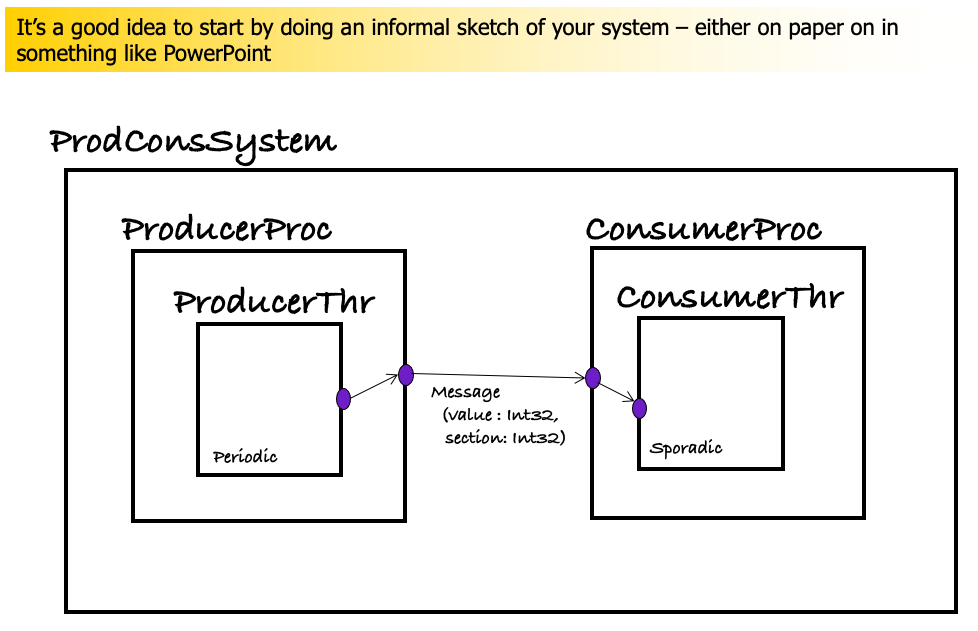
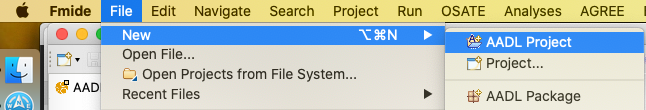
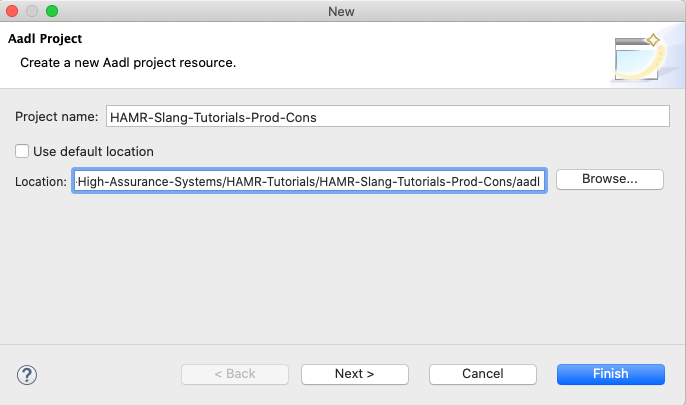
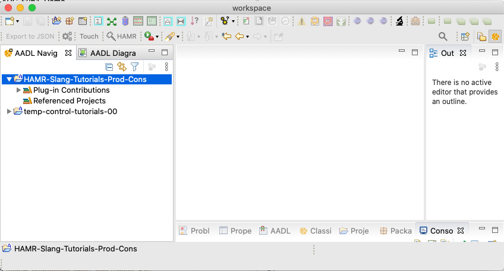
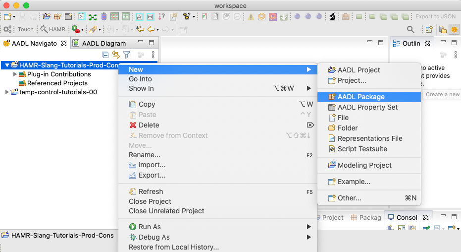
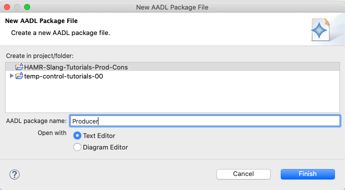
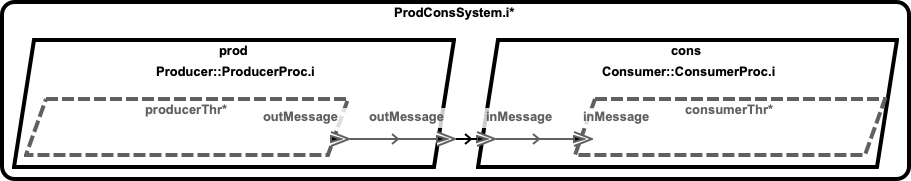

**Exercise: AADL Project from Scratch**

## Pre-conditions

* The FMIDE customization of the OSATE AADL editor should be installed as described in Tool Tutorial: HAMR Installation and the FMIDE/OSATE installation confirmed to be functioning correctly as in the Tool Tutorial: Loading an Existing AADL Project into OSATE/FMIDE.

* Understand the concepts of the OSATE/FMIDE Eclipse workspace as presented in Tool Tutorial: AADL OSATE Workspace Concepts 

## Objectives

*   Learn the basics of using OSATE to create a simple AADL project
*   Further solidify the understanding of syntax of AADL software components system, process, and thread
*   Learn how to create a instance model diagram of the system (the most common diagram for understanding AADL system/model structure)

## Description

In this exercise, you will build an AADL model of a simple producer / consumer system.
This will include defining simple threads, processes, and packages.

## Background

It is often useful to draw an informal diagram of your system before you start editing models in AADL/OSATE.
The figure below is an informal sketch of the system that we will build for this exercise.

* A producer thread sends a message with two fields to a consumer thread: a value field, and a section field (imagine a section number indicating a particular grouping/bucket of values).  Note that these fields are made up just to illustrate technical concepts of AADL structs -- they don't represent any realistic domain modeling.

* The producer thread is a periodic component -- it will be dispatched periodically to send messages to the consumer.

* The consumer thread is a sporadic component -- it will be dispatched by the arrival of the message.

* The producer thread is contained in a producer process; similarly for the consumer.  These two processes are integrated to form the top-level system.

## Exercise Activities

* Create HAMR project structure.  Create a folder/directory `HAMR-Slang-Tutorials-Prod-Cons` structure matching the image below to hold the AADL project that you will create in this project.   This is the standard directory structure that we recommend for all HAMR projects.  In this exercise, you won't use the `hamr` folder (we will use it in a subsequent exercise in which we add Slang code).  You will create your OSATE AADL project in the `aadl` folder.

* Use OSATE menus to create a new AADL project.  

  Use the OSATE menu option `File / New / AADL Project` as shown below to launch the New AADL Project Dialog.

  

  Set the fields in the New Project dialog as shown below (see notes below screenshot).
  

  Notes:
  * The `Project name` can be set to `HAMR-Slang-Tutorials-Prod-Cons` (or something similar)
  * The `Use default location` option should be *unchecked*
  * The `Location` should be set to the `aadl` folder from the *Create HAMR project structure* activity above.

  After OSATE creates the project, confirm that you see the `HAMR-Tutorials-Prod-Cons` project in the AADL Navigator as shown in the screen shot below.

  

* Create Producer Package.  Use the OSATE menu system (e.g., highlight the `HAMR-Tutorials-Prod-Cons` project as shown below, right-click to access the context menu, and the `New AADL Package` option) to create an AADL package called `Producer`.  

  

  Complete the New Package dialog as in the screenshot shown below.

  

* Configure Producer package imports.  Using the HAMR package template as guidance, configure the package imports using the `with` clause to `ProdCons`

        package Producer
        public
          with  ProdCons;
        
          -- package contents go here
        end Producer;

* Create a `ProdCons` package to hold system-level definitions including message type.  Using the OSATE menus and HAMR package template (following the steps used in creating the `Producer` package above), create a `ProdCons` package that imports the AADL base types, data model definitions, and `Producer` package (the `Consumer` import is not used yet, so it is commented out).

        package ProdCons
        public
          public
            with  Base_Types,         -- needed when using AADL base types
                  Data_Model,         -- needed when defining new types
                  Producer;  -- Consumer; -- access to producer and consumer processes
        
          -- package contents go here
        end ProdCons;

* Create `Message` type for messages sent from producer to consumer.  Using the HAMR templates as a guide, use an AADL data component type and implementation in the `ProdCons` package to create a "struct" data type called `Message` that has the following two fields.

   * value, which has type `Base_Types::Integer_32`
   * section, which has type `Base_Types::Integer_32`

* Create `ProducerThr` thread in the `Producer` package.  Using the HAMR templates as a guide, create a thread component type `ProducerThr` and implementation `ProducerThr.i` in the `Producer` package.

   * create an output event data port in the component type named `outMessage` with type `ProdCons::Message` 
   * set the dispatch protocol property to `Periodic`
   * set the period to `1sec`

* Create `ProducerProc` process in the `Producer` package.  Using the HAMR templates as a guide, create a process component type `ProducerProc` and implementation `ProducerProc.i` in the `Producer` package.

   * specify an output event data port in the component type named `outMessage` with type `ProdCons::Message` 
   * in the component implementation, specify a thread subcomponent instance named `producerThr` using the `ProducerThr.i` component implementation.
   * specify a port connection named `msgPTtoPP` that connects the `outMessage` port of `producerThr` to the `outMessage` port on the `ProducerProc` interface.

* Create the `Consumer` package.  In a similar fashion to the creation of the `Producer` package, create a `Consumer` package with `ProdCons` as the only import.

*Note: The model for `Consumer` artifacts is symmetric to those for `Producer`.  So for the steps that follow, you may find it convenient to simply copy the `Producer` artifacts and edit them to have consumer-based names and to reverse the directionality for ports/connections.*

* Create a `ConsumerThr` thread in the `Consumer` package.  Using the HAMR templates as a guide, create a thread component type `ConsumerThr` and implementation `ConsumerThr.i` in the `Consumer` package.

   * specify an input event data port in the component type named `inMessage` with type `ProdCons::Message` 
   * set the dispatch protocol property to `Sporadic` because we want this thread to be dispatched when a message arrives.
   * set the period to `1sec`

* Create a `ConsumerProc` process in the `Consumer` package.  Using the HAMR templates as a guide, create a process component type `ConsumerProc` and implementation `ConsumerProc.i` in the `Consumer` package.

   * specify an input event data port in the component type named `inMessage` with type `ProdCons::Message` 
   * in the component implementation, specify a thread subcomponent instance named `consumerThr` using the `ConsumerThr.i` component implementation.
   * specify a port connection named `msgCPtoCT` that connects the `inMessage` port on the `ConsumerProc` interface to the `inMessage` port of `consumerThr`.

Now we return to the `ProdCons` package (where we previously defined the `Message` type)
to define the integrated system.

* Create `ProdConsSystem` System.   Using the HAMR templates as a guide, create a system component type `ProdConsSystem` and a system component implementation `ProdConsSystem.i` in the `ProdCons` package.

   * The body of the component type will be empty because there are no features of the system interface (the system does not "connect to the outside world").
   * In the system component implementation, specify an instance of the `Producer::ProducerProc.i` process named `prod`, and specify an instance of the `Consumer::ConsumerProc.i` process named `cons`.
   * Specify a port connection `msgPPtoCP` from the `outMessage` of `prod` to the `inMessage` port of `cons`.

At this point, if you have not already done so, you may find it convenient watch the solution video that walks through the construction of the model.

*  Create a structure diagram from the system component implementation following the steps illustrated in the solution video.  When you have configured the diagram to show all of the subcomponents, etc.  it should look something similar to what is shown below.

