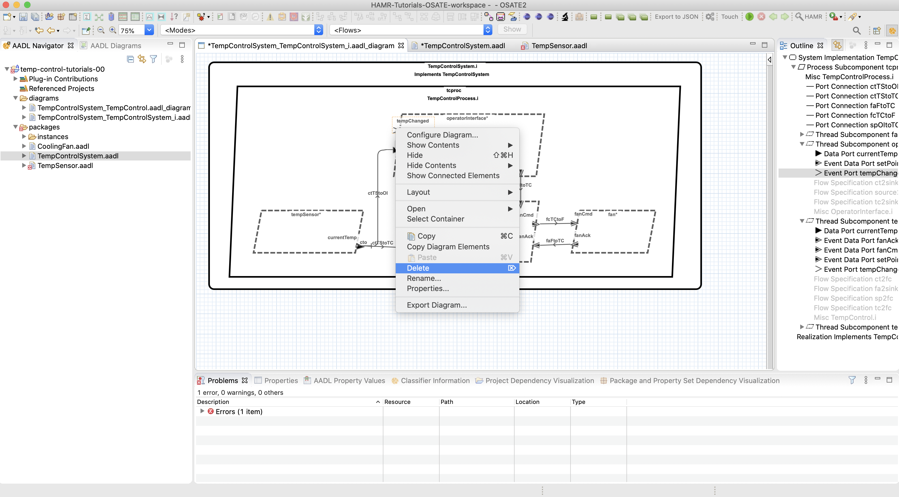

**Exercise: AADL Refactor**

**Refactoring ports/connections on Temperature Control example**

## Pre-conditions

*   The FMIDE customization of the OSATE AADL editor should be installed,
    as presented in the activities of Exercise: Confirm HAMR Install (alternatively, for advanced users, the 
    HAMR plug-in should be installed manually in OSATE).

*   The tutorial example HAMR-Slang-Tutorials-Example-00 should be imported into
    OSATE as an AADL project, as presented in the activities of Exercise: Confirm Install.

## Objectives

*   Become familiar with basic aspects of AADL models (ports and connections)
*   Use OSATE to perform basic edits on the AADL graphical and textual views of a simple model.

## Description

In this exercise, you will carry out a simple refactoring of some of the component ports
in the Temperature Control example.   This refactoring will involve changing the kinds of ports 
and connections used to communicate temperature information from the sensor to the controller (and to the operator interface).
This will require changing the AADL thread component types for `TempSensor`, `TempController`, and `OperatorInterface` components,
as well as making some simple changes to corresponding AADL flow specifications.

By performing this refactoring, you will gain an initial understanding of

*   AADL architecture models (basic ideas of ports and connections)
*   Using the OSATE editor to make simple edits in the AADL graphical and textual views.

## Background

This task assumes that you have AADL models for the HAMR-Slang-Tutorial-Examples-00 imported
into OSATE as an AADL project.  Instructions on how to do this were presented in the
Exercise: Confirm HAMR Install.

Starting from the state of the AADL Temperature Control model in the HAMR-Slang-Tutorial-Examples-00,
in OSATE, open `HAMR-Slang-Tutorials-Example-00/diagrams/TempControlSystem_TempControlSystem_i.aadl_diagram`

The initial model in OSATE should look like the diagram below.  Your task in this exercise is to refactor 
the model to use different kinds of AADL ports for the "current temp" data.

AADL has three kinds of component ports: data, event, and event data.  Data ports share data values from a producer to consumers.  Event ports provide notifications (simple events, no payload) from a producer to consumers (and notifications are buffered on the consumer side).  Event data ports provide message-based communication (events with data payloads) from producers to consumers (and messages are buffered on the consumer side).  When consumer threads have a sporadic dispatch protocol, events arriving on event and event data ports cause the thread to be woken up (i.e., they cause the thread to be "dispatched" in AADL terminology) and component application code is executed to process the arriving events.  See the Lecture _AADL: Modeling Embedded Software_ for further details.

In Temperature Control example, the `TempSensor` component needs to let the `TempControl` component know about new temperature sensor values.  It does this by (a) making the latest temperature sensor reading available to consumers on the `currentTemp` port and then (b) sending a notification to consumers on the `tempChanged` port.  Upon receiving notification, the consumers (e.g., the `TempControl` and `OperatorInterface`) "pull" the data from the `tempChanged` port.   An alternative approach is to have the `TempSensor` component publish the most recent sensor reading on an event data port (the sensor data is communicated as a message payload).  If we keep the `sporadic` dispatch protocol for `TempControl` and `OperatorInterface` threads, these consumer threads will be "woken up" to handle the arriving message, and they will extract the sensor data from the message payload.

## Exercise Activities

You will refactor the communication of sensor data to use the alternative event data message appraoch outlined above.  Specifically, you will remove the `tempChanged` event ports and change the `currentTemp` ports from `data` port to `event data` port.
You'll make these changes using both the AADL textual view and graphical view so that you can gain experience working with each and also observe how OSATE keeps both views in sync.

*  _Removing `tempChanged` connection between the sensor and the controller using the AADL graphical view:_  The `TempSensor`, `TempController`, and `OperatorInterface` components are "integrated in the `TempControlProcess`.  In the `TempControlSystem.aadl` file, navigate to the `TempControlProcess.i` implementation (e.g., click on this component in the outline view).   Scroll to the connections in the `TempControlProcess.i`, and you will see the following connections for `tempChanged` event notifications as shown in the screenshot below:

    *   `tcTStoTC: port tempSensor.tempChanged -> tempControl.tempChanged;`
    *   `tcTStoOI: port tempSensor.tempChanged -> operatorInterface.tempChanged;` 

   

   To use the graphical view to remove first connection, return to the `TempControlSystem_TempControlSystem_i.aadl_diagram` in the diagrams folder.   Highlight the `tempChanged` connection between the sensor and the operator interface, right-click on the connection to obtain the context menu, and select the delete option as shown in the screen shot below.

   

   Now, navigate back to the navigate to the `TempControlProcess.i` in the textual view and you should see an empty line where the textual specification for the just-deleted connection once was as shown in the screenshot below.
   
   

*  _Removing `tempChanged` connection between the sensor and the operator interface using the AADL textual view:_ At the current position in the `TempControlProcess.i` textual view, delete following line

    *   `tcTStoOI: port tempSensor.tempChanged -> operatorInterface.tempChanged;`

   Make sure there are no syntax error markers around where you deleted the line.   Now navigate back to the graphical view and you should see that the `tempChanged` between the sensor and operator interface has automatically be removed in the graphical view as shown in the screenshot below.

   

*  _Removing `tempChanged` port from `TempSensor` using the AADL textual view:_  In AADL Navigator sidebar, open the `TempSensor.aadl` and navigate to the declaration of the `tempChanged` port in the `TempSensor` component type (interface) as shown in the screenshot below.

   

*  _Removing `tempChanged` port from `OperatorInterface` using the AADL graphical view:_  Go to the `TempControlSystem_TempControlSystem_i.aadl_diagram` in the diagrams folder.   Highlight the `tempChanged` port in the `OperatorInterface` component (you should see a light orange dashed box around the port icon and port name), right-click on the port to obtain the context menu, and select the delete option as shown in the screen shot below.

   
   
*  _Removing `tempChanged` port from `TempControl` using the AADL graphical view:_  Delete the `tempChanged` port from the `TempControl` component using the same steps as above.  

As you delete the ports in the steps above, you will notice a few syntax errors being introduced (as indicated by the red Eclipse problem markers).  This is due to the fact that AADL flow specifications now have dangling refereces to deleted ports.  We will clean up these syntax errors later.

*  _Changing the category of the `currentTemp` from `data` to `event data` (`TempSensor`) using the AADL graphical view:_  In the graphical view, select the `currentTemp` port on the `TempSensor` interface, and right click to bring up the context menu.  Select _Properties_ in context menu to open the properties editor (for changing the AADL properties on this particular port) as shown in the screenshot below

   
   
   By the _Type_ entry, use the combo box to change the value from _Data Port_ to _Event Data Port_ as shown in the screen shot below.  
   
   
   
   Navigate to the textual view of the `TempSensor` thread to confirm that the declaration of the port has indeed been changed to `event data` as shown in the screen shot below.
   
   

*  _Changing the category of the `currentTemp` from `data` to `event data` (`TempControl`, `OperatorInterface`):_  For both the `TempControl` and `OperatorInterface` components, switch to the textual view, navigate to the `currentTemp` port declaration as shown in the screen shot below.  Change the port category from `data` to `event data`.

   

The example model contains AADL flow specifications which refered to the now deleted `tempChanged` ports, and these "dangling references" in the flow specifications are now giving syntax errors as shown in the screenshot below.  

In the components below, delete the corresponding flow specification. 

*   Remove `tempChanged` flow spec from `TempSensor` (and associated comments):

    * `tco: flow source tempChanged;`

*   Remove `tempChanged` flow spec from `TempControl`:

    * `tc2fc: flow path tempChanged -> fanCmd`

*   Remove `tempChanged` flow spec from `OperatorInterface`:

    * `tc2sink: flow sink tempChanged`

At this point, the refactoring is complete, and there should be no syntax errors in the model files.

The `TempControlSystem_TempControlSystem_i.aadl_diagram` model diagram should look similar the one shown in the screen shot below.

