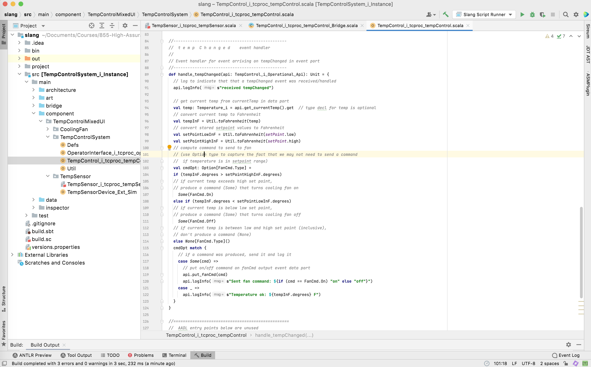
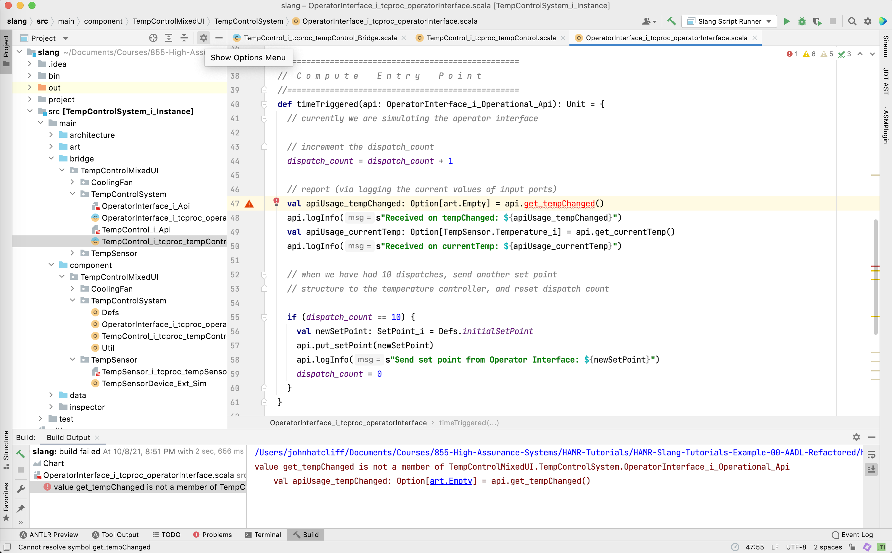

**Exercise: Slang Refactor**

**Refactoring Slang code's use of ports on Temperature Control example**

Last Updated: September 30, 2023
Author: John Hatcliff

## Pre-conditions

* You have OSATE/FMIDE and Sireum IVE installed.

* You have completed the following tutorials and exercises

   * Tool Tutorial: Loading an Existing AADL Project into OSATE/FMIDE
   * Tool Tutorial: Loading an Generated/Existing HAMR Slang Project into the IntelliJ-based Sireum IVE
   * Tool Exercise: Refactoring an AADL Model to Remove Ports and Change Port Categories

   You will be working with the state of the AADL model and Slang code at the end of these three activities.  In these files, the Temperature Control model has been refactored to use an event data port to communicate the current temperature, but the associated Slang code had not yet been changed.   Alternatively, if you don't have the models/code in this state, you can start with files HAMR-Slang-Tutorials-Example-00-AADL-refactored example files provided to you along with this exercise description. 

## Objectives

* Learn how to invoke the HAMR code generator for the Slang/JVM platform.
* Learn basic aspects AADL thread entry points as implemented in Slang.
* Learn basic aspects of the Slang APIs for communicating over AADL ports.

## Description

In this exercise, you will carry out a simple refactoring of some of the component code in the Temperature Control example.  This builds on a refactoring of the original Temperature Control AADL model carried out in a previous exercise.

In that exercise you changed the kinds of ports and connections used to communicate temperature information from the sensor to the controller (and to the operator interface).  Specifically, you eliminated the `tempChanged` event port and changed the `currentTemp` data port to an event data port.

In this exercise, you will regenerate the Slang code from the AADL model.  This will keep most of the existing code, but it will change the Slang APIs associated with your component ports to align with the refactored models.   This will leave the Slang code with some syntax errors because the old application code will not completely match the newly regenerated APIs for port communication.   To address this, you will then need to make some small changes in the Slang component application code to match the new version of the generated port APIs.  You will confirm that your refactored code is working correctly by compiling and running it in IntelliJ.

## Preparation

Open OSATE to the AADL files that resulted from Tool Exercise: Refactoring an AADL Model to Remove Ports and Change Port Categories. This should be the HAMR-Slang-Tutorial-Example-00 models that were changed since the original import according to the refactorings in the AADL Refactoring Tool Exercise.  When you originally imported the HAMR-Slang-Tutorial-Examples-00 models, there was accompanying Slang code in the `hamr/slang` folder.  That code is now out of alignment with the refactored AADL models and your goal in this exercise is to re-align them.

Alternatively, if you do not have the files in the state described above, you can use the files (including both `aadl` and `hamr` directories) from the HAMR-Slang-Tutorials-Example-00-AADL-refactored zip file or github folder provided to you along with this exercise description.  If you use the provided files, you will need to (1) import the AADL project in the `aadl` directory into OSATE/FMIDE and (2) import the Slang project `slang` folder into the Sireum IVE following the steps in the following tutorials.

* Tool Tutorial: Loading an Existing AADL Project into OSATE/FMIDE
* Tool Tutorial: Loading an Generated/Existing HAMR Slang Project into the IntelliJ-based Sireum IVE

Also, recall that for the Slang import in item (2), before you do the import into the IVE, you need to run `sireum proyek ive .` in the `slang` directory as described in the tool tutorial to generate the IntelliJ configuration files from the raw HAMR Slang project provided in the zip file.

Have both OSATE and Sireum IVE opened to the corresponding projects.

The `TempControlSystem_TempControlSystem_i.aadl_diagram` model diagram should look similar the one shown in the screen shot below.


## Exercise Activity - Code Generation

Like many AADL/OSATE analyses, HAMR code generation works off of a top-level system component implementation (more precisely, the AADL instance model generated from such a component implementation).   In this model and in most others in these tutorials, there is only one top-level system implementation component.  However, you may sometimes be working with a model that has multiple top-level system implementations that capture alternate architectures.

To perform HAMR code generation, highlight/select a top-level system component implementation in the OSATE editor.  There are multiple ways that this can be done, but we will emphasize selecting the implementation in right-hand-side outline view as shown in the screen shot below.


With the top-level system component implementation highlighted, invoke the HAMR code generator using the OSATE / Sireum HAMR / Code Generation menu option as shown in the screen shot below.


HAMR responds by (behind the scenes) (a) triggering OSATE to build an instance model for the implementation and (b) translating the instance model to the HAMR AADL Intermediate Representation (AIR) JSON format that will be used in the downstream code generation activities.

HAMR brings up a dialog asking the user to select the target HAMR platform.  Select the `JVM` option as shown in the screen shot below. 


Once the JVM platform has been selected, HAMR brings up a dialog box asking for some additional configuration parameters for the JVM platform code generation.

* Output Directory - set this to the directory where the Slang / IntelliJ project will be generated.  If you are following the HAMR convention for project structure, you have a directory `hamr/slang` in your project files -- this is the directory that you want to use and this is the directory that you will open with Sireum IVE / IntelliJ to work with the Slang project files (you should already have this open in the Sireum IVE following the *Preparation* steps above).

* Base Package Name - this is the name of the Scala/Slang package into which the generated Slang code should be placed (this lets you pick a base package name instead of having HAMR automatically generate one for you from the AADL artifacts).  For this current tutorial activity, we want to use the base package that already exists in our Slang project: `TempControlMixedUI`.

Enter the Output Directory (with the path modified as necessary for your installation) and Base Package Name as shown in the screen shot below.  Then press the `Run` button to launch the code generation process.


If there are no errors in your model, HAMR will write to the AADL console a listing of the files that it has generated as well as some hints about how to run the resulting Slang project in the Sireum IVE.


HAMR makes a distinction between (a) files used to hold application logic of the system and (b) infrastructure code files.  If HAMR sees that application files already exist in the target project, it will not overwrite those -- it will only overwrite the infrastructure and component API files derived from the structure of the AADL model.

To help you understand the distinction between these two categories of files, HAMR inserts the following comments in the files:

* Application files: `// This file will not be overwritten so is safe to edit`
* Infrastructure/API files: `// Do not edit this file as it will be overwritten if HAMR codegen is rerun`

The messages output during code generation shown in the screen shot above also indicate when a file is created/overwritten and when a file is not overwritten because it already exists.

At the end of the code generation output under the heading *Slang Instructions*, HAMR provides some hints about how to proceed with loading and running the generated Slang project.

## Exercise Activity - Compile and Observe Errors

After the code generation activity above, the Slang thread component application code is not aligned with the component/system infrastructure code generated from the refactored AADL model.

One way to observe the misalignment is to try to build the Slang project from the IntelliJ :guilabel:`Build` menu -- the compiler will report errors indicating the misalignment.

In the IntelliJ `Build` menu, select the `Build Project` option as shown in the screen shot below.


This will report several errors in the *Build Output* panes at the bottom of the IVE.  The errors are grouped by the files in which they occurred, and selecting the file names in the left lower pane will show the errors in the selected file.


When we successfully refactor the Slang code, these errors will be eliminated.
We will start with the error associated with the `TempSensor` component, so you may want to take a look at that one.

## Exercise Activity - Refactor the TempSensor Compute Entry Point Code

We have learned from our lectures that the AADL standard specifies that thread application code is organized into different types of *entry points* (realized in HAMR code via different methods) that are called at different stages of the system execution life cycle.  Each thread component has an initialize entry point that is called during system initialization before the system shifts to its normal *compute* phase.

Since it is declared to be periodic in the AADL model, the Temp Sensor's Compute Entry Point is realized as a `time triggered` method.  Each time the component is dispatched by the scheduler, this method will be executed.  You can see the main idea of the application logic: the (simulated) physical sensor value is read, the temperature value is placed on the `currentTemp` port, a notification is placed on the `tempChanged` port, and some basic logging is done.  When the time triggered method completes, the run-time infrastructure will flush the output port values to the communication infrastructure which will propagate the temperature value and notification to any consumers.

Due to the refactoring of the AADL model, we now have an error:

* the `put_tempChanged` method call is erroneous because that port no longer exists.  The new port category (*event data*) for the `currentTemp` event port now combines the actions of sending the current temperature and notifying (triggering the dispatch) of the `TempControl` component.

Remove (or comment out) the block of code:

    // set the out data port currentTemp to hold the read temperature
    api.put_currentTemp(temp)
    // put an event on tempChanged out event port to
    // notify subscribers (e.g., tempControl thermostat) that the
    // temperature has changed
    api.put_tempChanged()

and replace it with a single call to `put_currentTemp` as illustrated below:

    // send latest temp reading on the currentTemp out event data port
    api.put_currentTemp(temp)

Instead of using a two step process to (1) send the temperature data and (2) notify consumers, the `put_currentTemp` will use the new event data port to send a message with a temperature payload to consumers.  The arrival of the message at consumers will cause the consuming sporadic threads to be dispatched.

## Exercise Activity - Refactor the TempSensor Initialize Entry Point Code

Find the `initialise` method in the Temp Sensor component application logic ( `src / main / component / TempControlMixedUI / TempSensor / TempSensor_i_tcproc_tempSensor.scala`) as shown in the screen shot below.


There is no syntax error here: even though the `currentTemp` port was changed from a data port to an event data port, the api `put_currentTemp` for putting a value out the port has the same name/signature regardless if the port is a data or an event data port.  

Nevertheless, we want to change the code here as explained below.

The `put_currentTemp` method call was originally present because *AADL requires that all output data ports are initialized in the initialize entry point* (this ensures that, after the system initialization phase completes, all input data ports will have a value -- as set by the output data ports to which they are connected).   Currently, HAMR/Slang doesn't check that a data port is correctly initialized (this will be implemented in future versions).  Omitting the initialization will typically result in a runtime Some/None option error when the data port is read by the consumer thread.

However, now that the port is an *event data* port, putting a value on the port during initialization is no longer required.   In fact, it is the HAMR convention (though not a requirement) that output event data ports are not used to send values during initialization.   The reason for this is that input event and event data ports are not dequeued when running a thread's `initialise` entry point.  So sending an event or event data during initialization will lead to a queuing of the initial value which may simply be overwritten (if the input port queue on the consumer has a size of 1) by a new message when the compute phase begins, or it will result in two queued items at the consumers which may lead to the dispatching of a consumer (assuming it dequeues one message at a time) to be one compute step behind ("out of phase" with) the producer.

* Remove (or comment out) the `api.put_currentTemp(TempControlSystem.Defs.initialTemp)` method call and replace it by the comment `// (no output data ports to initialize)`

## Exercise Activity - Recompile and Observe Errors (some eliminated)

Rebuild the project using the `Build / Build Project` menu option as before.  You should see the previous error message associated with the `TempSensor` thread eliminated.

## Exercise Activity - Refactor the Message Handlers in the TempControl Compute Entry Point

For sporadic threads, HAMR represents the AADL Compute Entry Point as a collection of message handlers -- one for each input event / event data port.  The following screen shows the Temp Control entry point handler for the `tempChanged` input event port (see `src / main / component / TempControlMixedUI / TempControlSystem / TempControl_i_tcproc_tempControl.scala`).



Due to the way that HAMR code is structured, we see no errors in this code -- the *component application code*, but compilation errors in the Temp Control bridge code (the *component infrastructure code*) below indicate that the infrastructure code expects an application `handle_currentTemp` method, but the method is not found.  


In the newly generated Temp Control thread structure, the `handle_tempChanged` handler is no longer invoked/dispatched from the bridge infrastructure code, because the `tempChanged` port no longer exists.  But the infrastructure is expecting a `handle_currentTemp` method because the `currentTemp` port was switched from a data port to an event data port.

We fix the bridge code compilation error -- not by modifying the bridge code (that code is auto-generated) -- but by making sure that the application code contains a `currentTemp` handler for the bridge code to call.  Note that HAMR would have generated a skeleton for that handler in a fresh Slang project, but since we are re-generating code into application code that already exists, HAMR doesn't overwrite it to provide the `currentTemp` handler skeleton.

We need to change the application logic in component code file `TempControl_i_tcproc_tempControl` so that we handle the arrival of a current temperature value using code that is similar is similar to what we have in the now-outdated `handle_tempChanged` method.  So our general approach to refactoring will be to change the `handle_tempChanged` method to a handler for `currentTemp` and refactor from there.

* Change the name/signature of the `handle_TempChanged` method from

        def handle_tempChanged(api: TempControl_i_Operational_Api): Unit = {

  to

        def handle_currentTemp(api: TempControl_i_Operational_Api, value: TempSensor.Temperature_i): Unit = {


* Update the logging message to correspond to the new communication/dispatch structure.  Change

        // log to indicate that that a tempChanged event was received/handled
        api.logInfo(s"received tempChanged")

  to

        // log to indicate that that a currentTemp message was received/handled
        api.logInfo(s"received currentTemp")


* Remove (or comment out) the following read from the `currentTemp` port since the current temperature value is now communicated as a payload in the `currentTemp` event data message and its value is obtained via the `value` parameter of the handler.

        // get current temp from currentTemp in data port
        val temp: Temperature_i = api.get_currentTemp().get  // type decl for temp is optional

* In the Fahrenheit conversion, change the argument from `temp` to `value` to reflect the new source of the current temperature value.  That is, replace

        val tempInF = Util.toFahrenheit(temp)

  with

        val tempInF = Util.toFahrenheit(value)

* Now let's also fix the documentation for this event handler.  Since we are now handling the `currentTemp` event instead of `tempChanged`,
replace 
   ```
   //------------------------------------------------
   //  t e m p  C h a n g e d    event handler
   //
   // Event handler for event arriving on tempChanged in event port
   //------------------------------------------------
   ```
   with
   ```
   //------------------------------------------------
   //  c u r r e n t  T e m p    event handler
   //
   // Event handler for message arriving on currentTemp in event data port
   //------------------------------------------------
   ```


## Exercise Activity - Recompile and Observe Errors (more eliminated)

Recompile the project using the `Build Project` menu option.  You should see the previous error messages associated with the `TempControl` thread eliminated.  Only errors associated with Operator Interface thread are left.


## Exercise Activity - Refactor the OperatorInterface Compute Entry Point

The application code currently in the Operator Interface Component is a placeholder for richer functionality that we will add in future assignments when we implement a simple user interface for the system.  In these future assignments we will see that to obtain proper control of the threading, we typically implement user interface components as periodic components.  Thus, instead of having event handlers in the Operator Interface Compute Entry Point, we have a `timeTriggered` method.  In periodic components (in which message handlers are not generated for input event and event data ports), the contents of event and event data ports can be fetched using `get_ZZZ` methods where `ZZZ` corresponds to the port name.

The screen shot below shows the code for the Operator Interface Compute Entry Point (see `src / main / component / TempControlMixedUI / TempControlSystem / OperatorInterface_i_tcproc_operatorinterface.scala`)



In the following code, even though the `currentTemp` port has switched from an data port to an event data port, there is no need to change the code because HAMR currently uses the same method signatures to read a value from a data port as it does to read a value from an event data port.

    // report (via logging the current values of input ports)
    val apiUsage_currentTemp: Option[TempSensor.Temperature_i] = api.get_currentTemp()
    api.logInfo(s"Received on currentTemp: ${apiUsage_currentTemp}")

However, we need to remove the read from the `tempChanged` port since it is no longer present in the model.

* Remove (or comment out) the lines of code below

        val apiUsage_tempChanged: Option[art.Empty] = api.get_tempChanged()
        api.logInfo(s"Received on tempChanged: ${apiUsage_tempChanged}")


## Exercise Activity - Recompile (All System Errors Eliminated)

Recompile the project using the `Build / Build Project` menu option.  At this point, all errors should be eliminated in the system code, but there is an error reported in the test code.  We address that in the activity below.


## Exercise Activity - Refactor TempControl Unit Tests

HAMR code generation for the Slang / JVM platform includes unit testing infrastructure in the project `test` folder.  Some simple unit tests were provided in the original coding of the Temperature Control project to illustrate how to write HAMR unit tests.  The following screen shot shows that the provided tests now have syntax a error associated with the fact that the `tempChanged` port has been removed.


* Remove (or comment out) the lines of code below

        // put notification of new temp value on input event port
        put_tempChanged()

Note that code for the insertion of values into the `currentTemp` port does not need to be changed (even though the port category has been switched from data to event data) because HAMR currently uses the same testing method signature for putting a value into an input event data port as it does for putting values in a data port.

## Exercise Activity - Recompile (All Errors Eliminated)

Recompile the project using the `Build / Build Project` menu option.  At this point, all errors should be eliminated in the system code and test code.   You may get an information item (which you should ignore) associated with the `Aux_Types.scala` file, but no errors should be present in either the system code or test code.

## Exercise Activity - Run Unit Tests

To run the unit tests, right click on the `test / bridge / TempControlMixedUI / TempControlSystem / TempControl_i_tcproc_tempControl_Test` and then `Run TempControl_i_tcproc ...` as shown in the screen shot below.


Alternatively, you can click on the green arrow head in the source code file by the `TempControl_i_tcproc_tempControl_Test` class declaration or by the `test("High after set point")`.

Executing the unit tests should show that all tests passed.

## Exercise Activity - Run System

Run the refactored system by selecting the project `Demo` file (`src / Main / architecture / TempControlMixedUI / Demo`), right-clicking for a context menu and then selecting the menu option `Run Demo`


The output to the console should show the system executing "normally".   To stop the execution, you can press the red square on the left tool panel of the console to stop the execution or hit <return> twice.


## Change Log
  
  * February 2021 - Initial version
  * October 2021 - Update to reflect renaming of port APIs and migration to Proyek build system
  * September 2023 - Minor updates to text, and update code repository to reflect change in testing APIs (`executeTest` renamed to `testCompute`)


