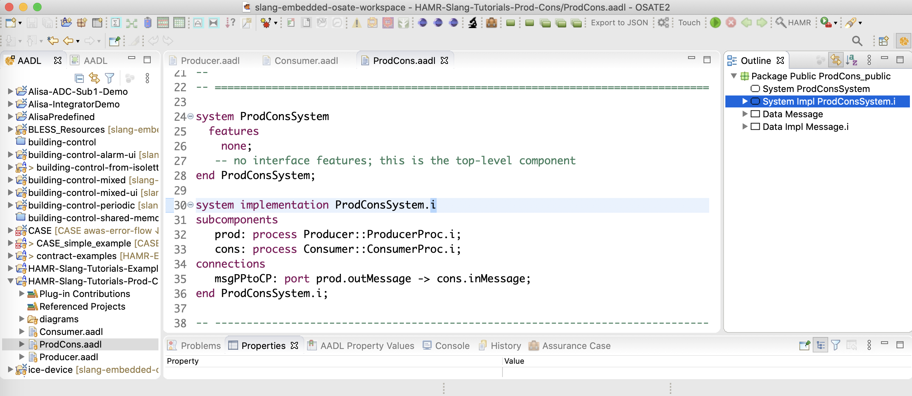

**Exercise: HAMR Slang Project from Scratch**

Given an AADL model (created from scratch in previous exercise), run HAMR Slang code generation and implement the system.

Last Updated: October 26, 2021; Author: John Hatcliff

## Pre-conditions

* The FMIDE customization of the OSATE AADL editor should be installed,
and the AADL Producer Consumer model should be present in OSATE as an AADL project (e.g., as resulted from previous *Tool Exercise: Creating an AADL Model from Scratch*).  

  Alternatively, if you don't have the Producer/Consumer model in this
  state, you can start with files HAMR-Slang-Tutorials-Prod-Cons-AADL-only.zip
  example files provided to you along with this exercise description. 

* Sireum IVE (IntelliJ) is installed.

## Objectives

* Learn the basics of invoking the HAMR code generator for the Slang/JVM platform -- generating Slang code skeletons and supporting AADL run-time infrastructure from an AADL model.

* Learn how to write simple Slang application code for AADL thread entry points in the Sireum IVE, including using HAMR auto-generated APIs for reading/writing to components and for logging.

* Learn how to compile and run a HAMR Slang system from the Sireum IVE.

## Description

In this exercise, you will take the model of the simple Producer/Consumer tutorial example in OSATE, prepare your directory structure for Slang code generation, invoke the HAMR code generator to generate Slang code from the model, code simple application logic for the Producer and Consumer threads, and compile and run the system.

## Background and Preparation

Below is the informal sketch of the system that we used in the *Tool Exercise: Creating an AADL Model from Scratch*.  

* A producer thread sends a message with two fields to a consumer thread: a value field, and a section field (imagine a section number indicating a particular grouping/bucket of values).  Note that these fields are made up just to illustrate technical concepts of AADL structs -- they don't represent any realistic domain modeling.   

* The producer thread is a periodic component -- it will be dispatched periodically to send messages to the consumer.

* The consumer thread is a sporadic component -- it will be dispatched by the arrival of the message.   The consumer will do some simple numerical calculation (just to illustrate simple Slang statements), and then generate some logging information.

* The producer thread is contained in a producer process; similarly for the consumer.  These two processes are integrated to form the top-level system.   HAMR Slang code generation as currently implemented focuses on thread components, and you will not see any direct representation of process or system boundardies in the Slang code.

When you completed the *Tool Exercise: Creating an AADL Model from Scratch*, we concluded
by creating a diagram of the system as shown in the screen shot below.  For reference, open this diagram in OSATE (in the `diagrams` folder of the HAMR-Slang-Tutorials-Prod-Con project).

If you do not have example files set up from the previous exercise, unzip the provided AADL artifacts HAMR-Slang-Tutorials-Prod-Cons-AADL-only.zip, and import the AADL project following the instructions in *Tool Tutorial: Loading an Existing AADL Project into OSATE/FMIDE*. 

## Exercise Activity - Ensure that the file system has the proper structure for a HAMR Slang project.

In the previous exercise, you created a folder/directory `HAMR-Slang-Tutorials-Prod-Cons` structure matching the image below. This is the standard directory structure that we recommend for all HAMR projects.  In the last exercise, all the AADL artifacts went in the `aadl` directory and we didn't use the `hamr` directory (which is for HAMR generated project code).

Ensure that a `slang` directory is created as a subdirectory of `hamr` as shown in the screenshot below.  When you invoke the HAMR code generator, you will use `slang` as the target directory for the code generation.

## Exercise Activity - Confirm AADL Model is Ready for Slang Code Generation

Open the AADL project HAMR-Slang-Tutorials-Prod-Cons in OSATE.  Confirm that the model files `Producer.aadl`, `Consumer.aadl`, and `ProdCons.aadl` have no syntax errors (i.e., no red Eclipse squiggles or markers in the files).

## Exercise Activity - Generate Code

Open the `ProdCons.aadl` file (`ProdCons` package).

Like many AADL/OSATE analyses, HAMR code generation works off of a top-level system component implementation (more precisely, the AADL instance model generated from such a component implementation).   In this model and in most others in these tutorials, there is only one top-level system implementation component.  However, you may sometimes be working with a model that has multiple top-level system implementations that capture alternate architectures.

To perform HAMR code generation, highlight/select a top-level system component implementation in the OSATE editor.  There are multiple ways that this can be done, but we will emphasize selecting the implementation in right-hand-side outline view as shown in the screen shot below.

With the top-level system component implementation highlighted, invoke the HAMR code generator using the OSATE / Sireum HAMR / Code Generation menu option as shown in the screen shot below.

HAMR responds by (behind the scenes) (a) triggering OSATE to build an instance model for the implementation and (b) translating the instance model to the HAMR AADL Intermediate Representation (AIR) JSON format that will be used in the downstream code generation activities.

HAMR brings up a dialog asking the user to select the target HAMR platform.  Select the `JVM` option as shown in the screen shot below.
Once the JVM platform has been selected, HAMR brings up a dialog box asking for some additional configuration parameters for the JVM platform code generation.

* Output Directory - set this to the directory where the Slang / IntelliJ project will be generated.  If you are following the HAMR convention for project structure, you have a directory `hamr/slang` in your project files -- this is the directory that you want to use and this is the directory that you will open with Sireum IVE / IntelliJ to work with the Slang project files (you should already have this directory created from the steps above).

* Base Package Name - this is the name of the Scala/Slang package into which the generated Slang code should be placed (this lets you pick a base package name instead of having HAMR automatically generate one for you from the AADL artifacts).  For this current tutorial activity, we want to use base package `ProdConsExample` (any name will work as long as it doesn't coincide with the package names like `Producer`, `Consumer`, etc. already in the project).

Once the fields above are entered,
press the `Run` button to launch the code generation process.

To see the results of code generation, use your operating system's file browser to
look at the contents of the Slang directory as illustrated in the screen shot below.

Below is a summary of purpose of each of the primary directories.

* `aadl` directory holds the AADL model artifacts that you just used to generate the Slang code.   Depending on your file browser settings, you may not see the files/folders beginning with a ".".   `.aadlbin-gen`, `.settings`, and `.slang` are all temporary folders created by OSATE and the HAMR plug-in as part of the HAMR code generation process.  The `aadl/.gitignore` file should contain entries that cause these files to not be stored in the git repository (since they are auto-generated as part of the work flow).  The other files are discussed in the previous "AADL Project from Scratch" exercise.

* In the `hamr/slang` folder, the `.idea` folder contains the project and build information for IntelliJ to be able to build and run the project.  You do not need to understand the contents of this folder.  However, the folder needs to be present to import the project into the Sireum IVE/IntelliJ.   With the default settings for HAMR, this folder is auto-generated/updated each time HAMR code generation is run (this can be disabled in the OSATE/Sireum preferences).  You can also generate this folder by calling the Sireum Proyek build tool from the command line using the `bin/project.cmd` file described below.  When using git, your `.gitignore` file should be configured to not check the `.idea` folder into git since it holds user/machine-specific information.  Since this folder is not checked into git, if you check out a HAMR Slang project from a git repository, you will need to use the Proyek build tool to generate the file (as described below) before you can important the project into the Sireum IVE / IntelliJ.

* `bin` contains the `project.cmd` file -- a file that you should become familiar with.  This file provides the realization of Sireum's Proyek build framework for this project.  This file is auto-generated by HAMR code generation based on HAMR's knowledge of the project structure.  Looking at the contents of that file, you should see various options for compiling, running, and testing the project from the command line.   In our tutorials, we will typically do all of these activities from within the Sireum IVE, so it is not important to know these details for now.  However, *here is something important:* the `.idea` folder described above needs to be present to import the project into the Sireum IVE.  The `project.cmd` file contains instructions on how to generate the `.idea` folder.  Typically, this process is carried out automatically by HAMR code generation.  However, if you are obtaining an existing project from git or a .zip file from a tutorial exercise, to be able to import the project into the Sireum IVE, `$SIREUM_HOME/bin/sireum proyek ive .` needs to be run from the `slang` folder to generate the IntelliJ project information in the `.idea` folder (see the `project.cmd` file for instructions). 

* `out` contains the compiled code produced by the Sireum IVE when building the system.  This directory is not present until you do the first build.  You will NOT need to look at the contents of this directory.  When using git, your .gitignore file should be configured to ignore this directory.

* `project` holds files that the IntelliJ-based Sireum IVE uses to manage the project.  HAMR knows how IntelliJ works and so it creates pre-built IntelliJ project metadata so that your files can be opened in IntelliJ with all the correct IntelliJ project options already set for HAMR Slang development.   You will NOT need to look at the contents of this directory.

* `architecture` holds the Slang representation of the AADL instance model (in `Arch.scala`) as well the `Demo.scala` file used to run the generated code.  You will need to open this folder in IntelliJ to access the `Demo.scala` file when you want to run the system.  `architecture` also holds some other files that configure the HAMR scheduling framework.  For this tutorial, you do not need to understand any of the files -- you only need to know that you will right-click on the `Demo.scala` file to run the system (explained later).

* `art` holds the Slang implementation of the HAMR AADL run-time. You do NOT need to understand the details of this code for this exercise.

* `bridge` holds the HAMR Slang infrastructure code for each of the thread components.  You may find it convenient to look at the `*_api.scala` files as you are coding to understand which methods are available to send/receive data on the ports of your components.

* `component` holds the HAMR Slang application code.  *This folder along with `data` and `test` are the main folders that you will be accessing when writing the code for your system.*
HAMR has generated code skeletons for in `ConsumerThr_i_cons_consumerThr.scala` and `ProducerThr_i_prod_producerThr.scala`, and you will fill in these skeletons to complete the implementation of the system.   The file names for these components are constructed from the AADL model elements.  For example, `ConsumerThr_i` is the named used for the consumer thread component implementation, `cons` is the name of the consumer process instance in the `ProdConsSystem.i` system component implementation, and `consumerThr` is the name of the thread instance in the `ConsumerProc.i`  process component implementation.  HAMR code generation uses these names along a path in the AADL architecture hierarchy to ensure unique file name for the thread implementation instance.

* `data` holds the HAMR-generated Slang representation of the AADL data types for the system.  You will need to look at these files to understand the structure of data (and how to construct and destruct the data) that you will be sending and receiving across ports.

* `test` holds the HAMR-generated Slang unit testing infrastructure for the system.
You will need to extend these files to add unit tests for your system (we won't do that in this exercise).

* `util` contains some utility classes to support testing.  You do not need to understand this content for this exercise.

HAMR makes a distinction between (a) files used to hold application logic of the system (e.g., in the `component`, `data`, and `test` folders) and (b) infrastructure code files.  If HAMR sees that application files already exist in the target project, it will not overwrite those -- it will only overwrite the infrastructure and component API files derived from the structure of the AADL model.

To help you understand the distinction between these two categories of files, HAMR inserts the following comments in the files:

* Application files: `// This file will not be overwritten so is safe to edit`
* Infrastructure/API files: `// Do not edit this file as it will be overwritten if HAMR codegen is rerun`

Finally, when learning how to import Slang code into the Sireum IVE, you may forget exactly which folder to import.  If you forget which directory corresponds to a Slang project, you can remember that the presence of the HAMR-generated `bin\project.cmd` indicates that the enclosing directory (`slang` in this case) is a HAMR Slang project that can be opened in the Sireum IVE (provided that the `.idea` folder has been generated).

After you open the `slang` directory in the Sireum IVE for the first time, and then compile, some additional files/directorys such as the `out` directory will be created by IntelliJ build system.

**Quick note regarding git**:  We're not using git for this exercise.  Hoever, when using `git` with your projects, in the Slang folder is it recommended to have a `.gitignore` file with the following contents:

    **/out/
    **/.idea/

This will ensure that the class files contained in `out` and the installation-dependent `.idea` folder are not checked into your git repository.
As explained in previous tutorials, you will want a similar `.gitignore` file in your `aadl` folder that includes the following entries:

    **/.settings/
    **/.aadlbin-gen/

## Exercise Activity - Open Slang Project in the Sireum IVE (IntelliJ)

Since HAMR generates IntelliJ project metadata (e.g., the `.idea` folder) along with generated code, since you have run the code generation, you can simply open the `slang` folder in the Sireum IVE (IntelliJ).  Use the *File* / *Open* menu option and select the `slang` directory to open/import the project into the Sireum IVE (the process of opening a project in the Sireum IVE was discussed in *Tool Tutorial: Loading an Generated/Existing HAMR Slang Project into the IntelliJ-based Sireum IVE*).

After the project has been opened, you can use the IntelliJ Project browser to see the folder structure of the project (illustrated in the screen shot below).

## Exercise Activity - Build / Compile

Even though HAMR is designed to generate a syntactically correct set of files, it's good to confirm that there are no syntax errors in the generated code before starting to write your application code.

In the top menu bar, select the `Build` option and then `Build Project` as shown in the screen shot below.

The project should compile without error and the `out` directory is generated containing the resulting .class files.

As an alternative to using the `Build Project` command, if you simply run the `Demo.scala` file as described below, the build action will be performed automatically.

## Exercise Activity - Run Skeleton Code

Open the `ProducerThr_i_prod_producerThr.scala` and `ConsumerThr_i_cons_consumerThr.scala` files in the `component` folder and study the structure of the auto-generated code skeletons for the system's thread components.  

The producer skeleton code is shown below.

Even though this is "skeleton code", the code is designed to be runnable.
Run the refactored system by selecting the project `Demo` file, right-clicking for a context menu and then selecting the menu option `Run Demo`

The output to the console should show some system messages concerning initialization from the HAMR AADL Run-time (Art) followed by the output of a few logging commands as shown in the screen shot below.

The first items of the logging output illustrate logging done in the producer's initilize entry point:

    def initialise(api: ProducerThr_i_Initialization_Api): Unit = {
      // example api usage

      api.logInfo("Example info logging")
      api.logDebug("Example debug logging")
      api.logError("Example error logging")

      api.put_outMessage(ProdCons.Message_i.example())
    }
    
In addition to the logging commands, the default code also illustrates how you can send a message at the Producer's port.  

    api.put_outMessage(ProdCons.Message_i.example())

puts a message on the `outMessage` port.  No console output is directly generated from this command.  When the `initialise` method completes (as indicated by the "Initialized bridge:..." logging information), the message on the `outMessage` port is released to the AADL HAMR run-time communication infrastructure, which will propagate the message, and it will arrive on the Consumer's `inMessage` port.  Incoming messages are never processed in the AADL initialization phase, so the message remains in the Consumer's `inMessage` port queue until the AADL compute phase starts.

After all thread initialize entry points are executed in the initialize phase of the the system, the compute phase will begin (as indicated by the "Begin execution..." logging information) and (before or after the Producer is dispatched -- depending on the underlying scheduling strategy) the Consumer's compute entry point message handler `handle_inMessage` will be executed to handle the queued `Message` (recall the the compute entry point of periodic threads consists of a `timeTriggered` method whereas the compute entry point of sporadic threads consists of a set of one or more event handlers for `in event` or `in event data` ports).

After these few steps, no further output will be displayed even though the thread components are being "executed".  This is because compute entry point for the producer (the `timeTriggered` method) has an empty body.  So even though it is being executed once per second, there is no output to display to the console, and it does not send out a message to trigger the `handle_inMessage` in the consumer's compute entry point.

To stop the (non-visible) execution, you can press the red square on the left tool panel of the console, or place your cursor in the console window and hit <return> twice.

## Exercise Activity - Provide Slang Declarations of Producer Component Local State Variables

Thread components will often have some local state (variable values) that will persist between dispatches of the thread.
To illustrate this concept, we will introduce the following producer component local variables to hold values to the `value` and `section` fields of the outgoing message.

* `value` - integer to hold the next value to send out
* `section` - integer to hold the next section to send out

At this point, we need to understand what types we should give these variables.  In any situation where you are dealing with data associated with values on ports (either retrieving/deconstructing values or reading or constructing values to send) you will want to consult the generated data types in the `data` folder.  The screen shot below shows the content of the `Message_i` file -- the Slang representation of the AADL `Message.i` struct type. 

The main thing that you need to be familiar with in such files are the `@datatype` structures as below:

    @datatype class Message_i(
      value : S32,
      section : S32) {
    }

In Slang, you construct values of data types by using the name of the type as a method (the constructor for the type) and you pass the values of fields as arguments:

     Message_i( ..v.., ..s..)

where `..v..` and `..s..` represent values for the fields.

Given a variable `myMessage` of type `Message_i`, you access the fields using the usual notation `myMessage.value` and `myMessage.section`.

From the `Message_i` `@datatype` declaration above, we can see the types of both fields are `S32` (signed 32-bit integer).   However, the types for the fields were defined as `Base_Types.Integer_32` in the AADL model.  HAMR uses the Slang `S32` type to represent the AADL `Base_Types.Integer_32`, and the representation is declared in the `Base_Types` file in the `data` folder.   The screen shot below shows excerpts of HAMR's declaration of Slang types for each AADL base type.  

The highlighted line defines the AADL derived type `Integer_32` as an alias for the Slang type `S32` (signed 32-bit integer).   For technical reasons, when generating Slang data types like `Message_i`, HAMR's uses the Slang `S32` type name instead of the type alias `Integer_32`.  However, you can use the alias such as `Integer_32` as needed.

Returning to the screenshot of the `Message_i` data type, the declaration in the `Message_i` file 

    def example(): Message_i_Payload = {
       return Message_i_Payload(ProdCons.Message_i.example())
    }

defines a default/example value for the message type called `example()`.  HAMR constructs such values for every AADL-derived type.  It uses these values in the auto-generated illustrations of the port APIs.   You should only use such values for initial system "tire kicking" and debugging.  In particular, your code should not rely on the existence / uniqueness of this value.  If you want something similar in your program, you should create your own special data type value(s) for your application code.

The `Message_i_Payload` defines a wrapper type for `Message_i` that will be used *internally by HAMR infrastructure code* when sending values across port connections (these "payload" types are generated for all AADL-derived types).  The wrapper adds metadata such as time stamps that support various diagnostic and debugging features of HAMR systems.  *You should never use the payload types in your application code*.

Returning our attention to coding the Producer in the `ProducerThr_i_prod_producerThr.scala` file, given the information above about the representation of the AADL `Message.i` type, we have the following possible types for our component local variables:

* Use `Base_Types.Integer_32`
* Use `org.sireum.S32`
* Use the Slang unbounded integer type `Z` and do explicit conversions between `Z` and `S32` types.

To strengthen the connection to the AADL model, we will use `Base_Types.Integer_32`.

Add the variable declarations for the producer component local variables to the producer object right above the `initialise` method.

    // This file will not be overwritten so is safe to edit
    object ProducerThr_i_prod_producerThr {

      // component local variables
      var value: Base_Types.Integer_32 = s32"0"  // representation of Slang literal 0 for the Slang `S32` type
      var section: Base_Types.Integer_32 = s32"0"

      def initialise(api: ProducerThr_i_Initialization_Api): Unit = {
      // example api usage

To use the `S32` literal constructor, you will need to add the following import

    import org.sireum.S32._

Note that Slang variables (following the Scala approach) always have to be initialized when declared (this avoids null references and similar issues).

At this point, you may want to re-compile your project to double-check that you have everything correct with the import and the variable declarations.

## Exercise Activity - Implement Producer Initialize Entry Point

We learned in our lectures that the AADL standard specifies that thread application code is organized into different *entry points* (realized in HAMR code via different methods) that are called at different stages of the system execution.  Each thread component has an *initialize* entry point (realized by the "initialise" method - note that "ise" is used instead of "ize" to avoid naming conflicts with a Scala keyword) that is called during system initialization before the system shifts to its normal *compute* phase.

Find the `initialise` method in the Producer component application logic ( `src / main / component / ProdConsExample / Producer / ProducerThr_i_prod_producerThr.scala`) as shown in the screen shot below.

Each HAMR representation of an entrypoint is passed an `api` object from the HAMR infrastructure holding the port APIs that can be called in that entry point. The auto-generated method body includes some illustrations of how to use the logging and output port APIs.  *You will typically delete this code as you are filling in your application code.*  The `api` object for the initialize entry point will only include methods for output ports (since, according to the AADL standard, input ports are not supposed to be read in the initialize entry point).  In contrast, the `api` object for the compute entry point includes methods working with both input and output ports).

If you want to generate output to the console in your application, you can use the methods for any of the logging categories: `Info`, `Debug` `Error`.  By default, HAMR prints the information for *all* categories to the console.

The code below

    api.put_outMessage(ProdCons.Message_i.example())

illustrates the use of the HAMR-generated API method for sending messages on the `outMessage` port (this and other port API methods are defined in the `bridge` folder in the `*_Api` files). This code uses the HAMR-generated default message `ProdCons.Message_i.example()` discussed above.

A thread component's initialize entry point (`initialise` method) is executed once in the system's initialization phase.  A thread's `initialise` method has two main objectives that are *required*: (1) initialize the local variables of the thread, and (2) put initial values on the output data ports.  Optionally, you may also send out one message on each output event or output event data port.  However, almost all the time, it is better to only send out messages on the event and event data ports in the compute entrypoint code (sending out event / event data messages in the initialize entry point often makes the system more difficult to reason about).

To emphasize the typical structure of initialize entry point code, take the text below from the provided Slang code templates file and paste it into the producer `initialise` method.

    // The Initialize Entry Point must initialize
    //  all component local state and all output data ports.

    // initialize component local state

    // initialize output data ports

Although we have technically already given initial values to our two local state variables as a by-product of the Slang initialization, to adhere to the principles of AADL, it is good style to give the variables initial values as part of the "official" AADL initialize entry point.  Add the code below under the `// initialize component local state` comment.

    // initialize component local state
    value = s32"0"    // start value at 0
    section = s32"0"  // start section at 0

The producer component has no output data ports, so we have no code to add there.  You can either delete the comment about data ports or indicate in a follow-up comment that there are no data ports to initialize.

    // initialize output data ports
    //  (no output data ports to initialize)

Finally, add the following simple logging message at the start of the `initialise` method:

    api.logInfo("Producer Initialize Entry Point")

At this point, your producer code should look something like what is illustrated in the screen shot below (I've added in some headers in comments to help distinguish the important sections of the the producer application code).

## Exercise Activity - Implement Producer Compute Entry Point

The *compute entry point* for an AADL thread implements the main application logic for the thread.   For a periodic component, HAMR represents the compute entry point via a method named `timeTriggered` that is called by the HAMR AADL run-time infrastructure at the beginning of the thread's period.  Below is the method skeleton generated by HAMR
  
    def timeTriggered(api: ProducerThr_i_Operational_Api): Unit = {
    // example api usage

    }

HAMR lists no example code under "// example api usuage" because it already illustrate methods for output ports in the `initialise` entry point, and there are no input ports for this component (so there are no input port APIs to illustrate).  We'll delete the comment and fill in the method body with our application code.
  
In our Producer compute entry point application code, we want to do the following:

* construct a message holding the current values of `value` and `section`
* put the message on the `outMessage` port.
* increment the `value` variable (with roll-over at the value of 20, i.e., `value` will take on the values 0..19)
* if `value` roles over, increment `section`.

Here's how we would construct and send the message in Slang

    // construct message "record"
    val m: ProdCons.Message_i =  ProdCons.Message_i(value,section)
    // put the message on the `outMessage` port
    api.put_outMessage(m)

The constructor for `Message_i` which was defined in the `data` folder in the `ProdConsExample.ProdCons` package is called with the current values of `value` and `section` as arguments. 

Put in a logging call to indicate that Producer has put a message on the output port:

    api.logInfo("Producer Compute Entry Point puts message on outMessage port")

Note that we phrase this as "producer *puts* a message on the port" instead of "sends a message" because the message isn't actually sent at this point: It is queued on the output port for sending and is released to the communication infrastructure *after* the `timeTriggered` message completes.

When incrementing the `value` variable, the only tricky thing is that we need to use the Slang `S32` literal notation for the "1".

     // increment value
     value = value + s32"1"

To implement the value "rollover", we can use a Slang/Scala conditional statement as shown below.  If the rollover condition is satisfied, `section` is incremented.

    if (value == s32"20") {  
       // rollover to 0
       value = s32"0"
       // if value rolls over, increment section
       section = section + s32"1"
    }

At this point, we have finished the application code for the Producer -- covering both the initialize entry point and compute entry point (a screen shot of the completed `timeTriggered` method is given in the next section).

## Exercise Activity - Compile and Run 

Build the project using the `Build / Build Project` menu option and run the project by running the `Demo` file as illustrated previously (alternatively, just "run" as the run step will automatically invoke the build step).  The main thing that you should observe in the run is that console output now continues as the system runs instead of stopping after a few logging messages as it did when running the default/skeleton methods for the Producer.  This is because we now have the Producer periodically sending messages to the Consumer (and the auto-generated default message handler for the consumer does some simple logging).

The screen shot below shows the console activity at the point of the first roller over of `value`.

## Exercise Activity - Provide Slang Declarations of Consumer Component Local State Variables

To illustrate component local state for the Consumer, we will introduce a simple integer variable to count the number of messages received over the course of the system execution.
Following the same approach as for the Producer thread, add the following declaration before the `initialise` method.

    var numMessagesReceived: Z = 0    // use Slang unbounded integer type "Z"

This variable's value is not related to the AADL-derived types being used for port-communicated data.  Therefore, it is possible for use to unbounded integer type `Z` from Slang instead of a Slang representation of an AADL-derived type.  For `Z`, we can use regular integer literals, we don't need special representations like `s32"0"`.

## Exercise Activity - Implement Consumer Initialize Entry Point

The Initialize Entry Point application code for the Consumer is similar to that for the Producer: we'll just initialize the component local state, and there are no output data ports to initialize.   We'll toss in a logging action at the start of the method.

At this point, your Consumer code should look something similar to that below.

## Exercise Activity - Implement Consumer Compute Entry Point

Since Consumer is a sporadic thread, it's compute entry point consists of handlers for all of its input event and event data ports.  It only has one such port, so it has a single handler for the `inMessage` port and the auto-generated default behavior is shown in the screen shot below.

The handler has a formal parameter `value` with a type matching the port type.  If a message has arrived on the `inMessage` port, the HAMR AADL infrastructure will dequeue the message from the port queue and place it in an application port data structure that the user code can access through the generated port APIs.  The application port values will remain "frozen" as the entry point executes (they won't be updated again until the next dispatch).  This ensures that there will be no race conditions between the application code reading the port and other components writing to the port.  The AADL run-time (HAMR ART) infrastructure supplies the contents of the application port to the handler in the `value` parameter.

Some logging is illustrated, and one noteworthy aspect is the use of the Scala string interpolation notation `s"received ${value}"` to splice in the value of the `value` parameter into the string.  You will likely use this a lot in your HAMR Slang programming, so you may want to read up on the general concept here: https://docs.scala-lang.org/overviews/core/string-interpolation.html

The next line

    val apiUsage_inMessage: Option[ProdCons.Message_i] = api.get_inMessage()

uses the auto-generated api to get the contents of the `inMessage` application port which is being maintained by the HAMR ART.  We don't actually need to get the value in this context because it has already been passed in as the `value` parameter of the handler.  You use this method when, e.g., you are in a periodic component compute entry point `timeTriggered` method or any other AADL compute entry point context where a particular port variable value has not been supplied as a parameter to the entry point.  Even though it is not needed here, HAMR's philosophy is to illustrate all of the API methods in its default entry point implementation.

The second thing to note here is the use of the Scala/Slang `Option` type which also appears in many other typed functional languages such as ML or Haskell. `Option[T]` can be viewed as a container for 0 or 1 values of the type `T`.  The idea is that there may or may not be a value returned by `get_inMessage` -- the result depends on whether or not there was a message on the `inMessage` queue.  Of course, in this context we know there was a message in the queue because HAMR ART has called the handle method.  However, imagine that we are in a `timeTriggered` method on a periodic component where we don't know if a message is in the queue at the point where we are dispatched due to the period starting.  If there was no message, `get_inMessage` will return a `None` option value.  If there was a message, `get_inMessage` will return a `Some(m)` option value where `m` is the message value.  The typical approach to working with returned option values is to use Scala/Slang pattern matching to systematically handle the `None` and `Some(m)` cases.  For more details on Slang options, see the Slang Reference Manual.  Slang option types are a bit more restrictive that those for Scala.  You can read about full Scala option types, see e.g., https://www.tutorialspoint.com/scala/scala_options.htm

In our Consumer compute entry point application logic, we want to do the following:

* retreive the fields of the incoming message and print their values in a logging call.
* increment the variable `numMessagesReceived` and output its new value in a logging call,

For the first item, you can do something like the following:

    // access fields of incoming message for logging output
    api.logInfo(s"Consumed inMessage value   ${value.value}")
    api.logInfo(s"Consumed inMessage section ${value.section}")

To access the fields of the `Message_i` data type, use the "." field selector notation from Slang/Scala.  In the
`value.value` of the first logging call, the first `value` is the name of the `handleinMessage` formal parameter `value` and the second `value` is the field name from `Message_i`.

For the second item, you can do something like the following:

    // increment message count and log total received so far
    numMessagesReceived = numMessagesReceived + 1
    api.logInfo(s"# messages received by Consumer: ${numMessagesReceived}")

The complete `handle_inMessage` can be seen in the screen shot in the following section.

## Exercise Activity - Compile and Run 

Now compile and run the system (run "Demo").  Your output should like something like what is shown in the screen shot below.

## Conclusion

At this point in the HAMR Slang Tutorial series and lectures, you should feel confident in your understanding of
* building simple AADL models
* running HAMR code generator for the Slang/JVM target
* the structure of AADL thread entry points in HAMR Slang generated code
* coding simple application logic in HAMR Slang thread entry points
* running a HAMR Slang system

You may want to spend time constructing your own simple AADL model and associated HAMR Slang system.

Before being totally prepared for building larger systems, we will need to cover the following content:
* details of all AADL types and their representations in Slang
* unit testing HAMR Slang thread components

Also, you need to become familiar with the syntax and semantics of Slang itself.  We won't cover that in this tutorial series since the focus is on HAMR, but Slang web site provides reference material, examples, and tutorials that can help you learn the details.

