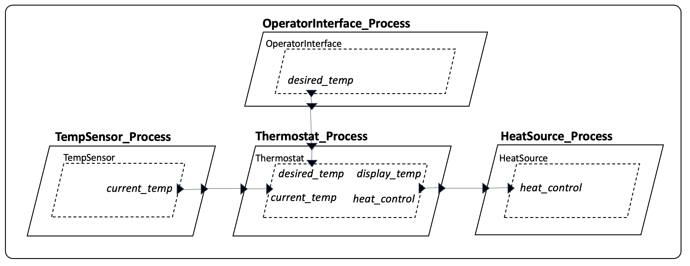
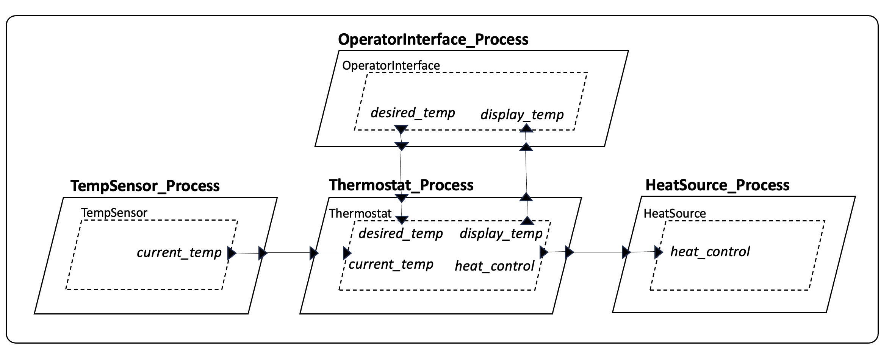

# HAMR Exercise: Adding a Display Temperature (Part 1 - SysMLv2 model) 

**Purpose**:  The purpose of this exercise is to get you familiar with basic aspects of HAMR SysMLv2 models and working with the HAMR SysMLv2 CodeIVE editor.  Starting from an initial model for the Simple Isolette system, you will go through the steps of 
 - opening an existing HAMR SysMLv2 model
 - navigating the different files from the model
 - making changes to the model (adding some new ports)
 - running the HAMR type checker to check the well-formedness of your model

Your updates to the Simple Isolette system will add new ports to the model to enable the Thermostat component to communicate the current temperature reading to the Operator Interface for to be output on the display (this will be simulated; you won't need to do any UI programming).

Upon completion of Part 1, you will have produced version of the model which we will use for an exercise on HAMR code generation in Part 2 of this exercise.

The starting files of this project also include a complete Rust implementation of the system.  In Part 2 of this exercise, you will run HAMR code generation again to update the Rust implementation project (add infrastructure code for the new port communication), and then you will add application logic to multiple Rust components (the Thermostat and Operator Interface) to realize the new temperature display functionality.

## Prerequisites and Resources

Before working through this exercise, you should have gone through the following HAMR lectures (or read the equivalent documentation):

* HAMR Overview (Modeling Part 1 and Rust Implementation Part 3)
* HAMR Semantic Concepts and Architecture Building Blocks
* HAMR CodeIVE for SysMLv2 (working with SysMLv2 models for HAMR)

## Excercise Overview

This exercise is based on the "Simple Isolette" system concept used in a number of other HAMR tutorials and examples.  The starting files (including SysMLv2 models and associated Rust code for seL4 microkit) provide a simple implementation for this idealized system.   The starting system has the following HAMR architecture.

The goal of this system is to control the air temperature in an infant incubator product called the "Isolette".

* The OperatorInterface provides a user interface for the caregiver (nurse), allowing the input of a desired air temperature range within the Isolette.   The desired temperature range (a low bound and a high bound) are passed in data structure of two fields to the Thermostat.  This is implemented as mock component that uses a simple simulation to generate appropriate temperature ranges.
* The TempSensor thread senses the air temperature in the Isolette and makes it available to the Thermostat thread.  This is implemented as a mock component that uses a simple simulation to generate appropriate temperature values.
* Thermostat considers the current temperature and the desired temperature range and sends an ON/OFF command to the heat source.  This heat control output indicates if the heat source should be on or off.  This is a fully implemented (but still simplistic) component that implements typical "control laws" for a simple thermostat.  In fact, the control laws are formalized as contracts (GUMBO contracts at the model, and then from these HAMR auto-generates Verus contracts at the source code level) -- we won't use the contracts in this exercises, but they still are interesting for you to study.
* The Heat Source thread controls the heating element for the system.  In a full system, there would be some sort of driver to the underlying hardware interface for the heating element (as we would also need to do for the Temp Sensor).  In the current implementation, this interaction with underlying driver is mocked up.

Each of the four threads (which correspond to real time tasks) is encapsulated in a Process component (corresponding to an seL4 microkit protection domain).  These protection domains in seL4 provide spatial and temporal partition between all the components in the system.

You'll note that in the current architecture for the system, even though the caregiver has entered a desired temperature range, they have no way of knowing the specific current temperature in the Isolette (which is safety issue).

Your task in this exercise is to modify the architecture to allow the Thermostat to forward its information about the current temperature to the Operator Interface so that it can be displayed on a user interface for the caregiver.  We refer to this information as the "display temperature".

The figure below should the desired architecture for an updated version of the system.   In Part 1 of this exercise, you will modify the SysMLv2 models appropriately to achieve this new architecture.   In Part 2, you will update the Rust implementation to achieve the associated functionality.

You can see from the updated architecture that four ports were added to achieve the full communication across all the Thread and Process boundaries.   In addition, three connections were added.   These are the features that you need to manually add to the SysMLv2 model in Part 1 of this exercise.

## Starting Files

The starting project (which includes both SysMLv2 models and Rust implementation) can be found in the folder `HAMR-SysMLv2-Rust-seL4-P-DP-Example` in this repository (here is [link](../../HAMR-SysMLv2-Rust-seL4-P-DP-Example/)).  Copy this folder (the *folder* itself, not just the contents) into your personal git repository.  One reason that it's important to copy the entire folder is that it contains several `.gitignore` that configure the folder for git use (e.g., by ignoring the very large executable files associated with Rust builds).  Open the `sysmlv2` subfolder in the CodeIVE to work on Part 1 of this homework. 

Use the CodeIVE to make the requested changes below to the model and to perform HAMR Type Checking.  Commit and push your completed model files to your personal repository with a commit message such as "Simple Isolette add DT - Part 1 - Models completed".

As you work, you may consult the documentation for working with SysMLv2 and CodeIVE in the [HAMR documentation](https://hamr.sireum.org/hamr-doc/).  

## Activity 0 - Commit the Starting Files to a Git Repository

To understand the functionality (and the benefits) of HAMR, it will be useful to see (via file diffs) the updates to models and code that you have to make, versus updates to the code and microkernel specifications that HAMR makes for you.

* **Task:** After retrieving the starting files for the exercise as described above, commit those to your personal git repository.   

## Activity 1 - Add Ports to the Operator Interface Thread and Process

* **Task:** Add an input data port `display_temp` of type `Temp` (already declared in the model) to the operator interface thread  in `Isolette_Software.sysml`) to receive a temperature to display on the operator interface.  The intent is that on each activation of the operator interface task, the `display_temp` port will be read, and its value placed on operator interface console.

* **Task:** Add a similar port in the `Operator_Interface` Process component (in `Isolette.sysml`).

Note: In the seL4 deployment, the thread port declaration will cause a `get_display_temp` API call to be available for the application code in the operator interface thread, and the process port declaration will give the operator interface protection domain read permission to a shared memory region associated with `display_temp` communication.

## Activity 2 - Add Ports to the Thermostat Thread and Process

* **Task:** Add an output data port `display_temp` to the thermostat thread (in `Isolette_Software.sysml`) to send a temperature to display on the operator interface.  The intent is that on each activation of the thermostat task, 
the the `current_temp` input from the temp sensor will be forwarded through the output `display_temp` port to the operator interface.

* **Task:** Add a similar port in the `Thermostat_Process` component (in `Isolette.sysml`).

Note: In the seL4 deployment, the thread port declaration will cause a `put_display_temp` API call to be available for the application code in the thermostat thread, and the process port declaration will give the thermostat protection domain write permission to a shared memory region associated with `display_temp` communication.

## Activity 3 - Make Connections Between the New Ports

* **Task:** In the `Operator_Interface_Process`, add an internal connection from the `display_temp` input port of the Operator Interface Process to the input port of the contained Operator Interface Thread (you can name the connection something like `dt` as an abbreviation for "display temp").  

Note: In seL4 deployment, this represents an API binding and infrastructure code communication between the microkit protection domain input for the `display_temp` (a read access to the shared memory region for the `display_temp` communication) and the `get_display_temp` API in the application code thread for the operator interface. 

* **Task:** In the `Thermostat_Process`, add an internal connection from the `display_temp` output port of the `Thermostat` Thread to the output port of the encapsulating `Thermostat_Process`.

Note: In seL4 deployment, this represents an API binding and infrastructure code communication from the `put_display_temp` API for sending out a display temp value used the thermostat application code thread for the thermostat to the microkit protection domain output for the `display_temp` (a write access to the shared memory region for the `display_temp` communication).

* **Task:**  In the `Isolette_System`, add a connection from the `display_temp` output port of the `Thermostat_Process` instance `thermostat` to the input port of the `Operator_Interface_Process` instance `operator_interface`.   

Note: In seL4 deployment, this represents a one way path of data between the protection domain structure for the thermostat and the protection domain structure for the operator interface using the shared memory region associated with communication of `display_temp`.

## Activity 4 - Run HAMR Type Check on the Models

* **Task:**: In the CodeIVE, using the VSCode command pallete to run the HAMR Type Check on the models to check them for well-formedness in preparation for HAMR code generation.  Ensure that there are no problems reported.

## Activity 5 - Commit the Completed Model Files

* **Task:** Commit and push the file changes to your git repository (those only changes thus far should be in `Isolette.sysml` and `Isolette_Software.sysml`).   Use the git web interface (or some local git application) to view the changes in the files.  If you only made the minimum changes to accomplish the tasks above, you should see 7 lines in the models changed (4 port lines, 3 connection lines). 

