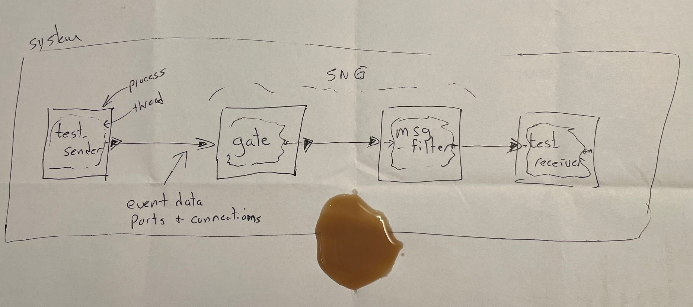

# HAMR Exercise: Developing a HAMR System From Scratch (Part 1 - SysMLv2 model) 

**Purpose**:  Now that you have learned the basic HAMR artifacts and workflows by working with an existing system, in this exercise you will expand your knowledge and confidence by developing a system (models and component implementations) from scratch.  In addition, where as the previous Simple Isolette system used data ports throughout, this system will use event data ports (which enable input and output ports to hold a message OR to be empty).

You will go through the steps of 
 - setting up the folder structure for a typical HAMR SysMLv2 system
 - assessing informal system requirements and design concepts
 - creating SysMLv2 models that satisfy the requirements and design concepts
 - running the HAMR type checker to check the well-formedness of your model

Upon completion of Part 1, you will have produced version of the model which we will use for an exercise on HAMR code generation and testing in Part 2 of this exercise.

This exercise also introduces some basic concepts related to high-assurance firewalls and network guards -- these are examples of a broader class of security-related network devices called "cross domain solutions".  If you do a web-search for that term, you can find a lot of information and about architecture and certification of cross domain solutions (e.g., see this [info from the Australian government](https://www.cyber.gov.au/sites/default/files/2025-03/Fundamentals%20of%20Cross%20Domain%20Solutions%20%28October%202021%29.pdf)).

## Prerequisites and Resources

Before working through this exercise, you should have gone through the following HAMR lectures (or read the equivalent documentation):

* HAMR Exercise on Refactoring the Simple Isolette to include a new data port (Parts 1 and 2)

Our previous Simple Isolette example did not include `event data` ports which you need for this example to present the concept of messages being present or absent in a port.  You can find a simple producer/consumer example that illustrates these concepts [here](../HAMR-SysMLv2-Rust-seL4-P-EDP-Prod-Cons-Example/).  You can take a look at the models to see how `event data` are declared and in the Rust crates to see how you get an `event data` input port's state and check to see if it is empty or if it has a message in it.

## Background

Cross domain solutions (CDS) are specialized security devices or integrated systems—combining hardware and software—that serve as controlled interfaces to enable the secure access or transfer of information between different security domains. These domains typically operate at varying classification levels or trust boundaries, such as between classified and unclassified networks, different military or intelligence networks, or air-gapped systems. Defined by standards like those from NIST and CNSSI as a form of controlled interface, CDS enforce predetermined security policies to prevent unauthorized data flows, data spills, or the introduction of threats, while allowing necessary information sharing. They often incorporate multiple layers of protection, including content filtering, deep inspection, virus scanning, auditing, and hardware-enforced separation (such as data diodes for unidirectional flows), distinguishing them from simpler devices like firewalls.

CDS come in types such as access solutions (allowing viewing across domains), transfer solutions (moving data one-way or bidirectionally), and multilevel solutions, with many accredited under rigorous programs like the U.S. Department of Defense's "Raise the Bar" initiative for high-assurance environments. Commonly deployed in government, defense, intelligence, and critical infrastructure settings, these solutions support Zero Trust principles by inspecting every transfer, validating compliance, and ensuring only approved data crosses boundaries. This makes them essential for balancing operational needs—like timely collaboration—with stringent confidentiality, integrity, and cybersecurity requirements in high-stakes scenarios.

Cross domain solutions (CDS) perform deep content inspection and enforcement of strict security policies when data moves between domains of different trust or classification levels. One key activity is dropping messages (or packets, files, or transactions), where the CDS outright discards any message that fails validation checks. This could occur if the message contains malware signatures, violates structural rules (e.g., invalid protocol formatting or non-compliant schemas), includes unauthorized content types, or breaches policy rules such as exceeding size limits or containing prohibited keywords. Dropping serves as a fail-safe mechanism to prevent any potentially malicious or non-conforming data from crossing the boundary, aligning with principles like "block by default" and hardware-enforced separation (often via data diodes in unidirectional flows). This rejection is typically logged for auditing, ensuring traceability without allowing partial or risky passage.

Another critical CDS function involves reducing the information content of messages through techniques like scrubbing, sanitization, or field-level modification to minimize risk while preserving necessary utility. This includes scrubbing fields by removing or redacting sensitive elements (e.g., metadata, hidden layers, author details, embedded scripts, macros, or PII like names and locations) to prevent data leakage or exploitation. Fuzzing message fields (or more precisely, applying rigorous validation and transformation akin to positive security models) often occurs as part of content disarm and reconstruction (CDR): the CDS deconstructs the message or file, discards non-essential or risky portions, normalizes content to strict schemas, and rebuilds only "known-good" elements. This deliberately reduces entropy or richness—stripping active code, extraneous data, or hidden payloads—ensuring the transferred version is clean and policy-compliant, even if it means delivering a less detailed or "downgraded" result. These actions collectively enforce Zero Trust at the boundary, balancing secure sharing with protection against threats like malware exfiltration or inadvertent spills in high-stakes environments.

This exercise uses a very simple system that starts to introduce concepts associated with network guards.  Network guards are network devices that sit on the boundary of a compute node and a network and they control the information (network messages) moving in and out of the compute node.  In this exercise, we will consider two basic types of guard actions described above:

 - dropping messages of certain types
 - reducing the information content of certain fields

The informal system requirements and proposed design concepts for the Simple Network Guard (SNG) are given below.

# Simple Network Guard (SNG) Concept

The SNG implements a uni-directional guard for messages moving off a high-security compute node.  The guard is implemented as a pipeline of stages.

## System Boundary and External Interfaces

### Inputs
  
  - The system inputs include
      - an ingress port that receives messages from the system context (e.g., coming internally from the high-security compute node)

### Outputs      

  - The system outputs include
      - an egress port that publishes any messages passing the guard into the system context (e.g., onto a less-secure network).

## Data Requirements

- SNG shall process messages with two fields:
    - security_level - security level of message
        Values: Public, Restricted, Critical
    - payload - message payload
        Values: 32-bit signed integers

## System Requirements

- Req_C: No critical messages received through the ingress port are emitted through the egress port (all critical messages are dropped)

- Req_R_1: All restricted messages received through the ingress port shall be emitted through the egress port
- Req_R_2: Each restricted message InR received through the ingress port shall have a modified version OutR flowing through the output port with the following relationship between InR and OutR:
   (a) if the payload of InR is greater than 100, the payload  of OutR is modified to have the value of 100,
   (b) if the payload of InR is less than 0, the payload of OutR is modified to have the value of 0, and
   (c) if the payload of InR is greater than or equal to 0 and less than or equal to 100, the payload of OutR is unchanged

- Req_P: All public messages received through the ingress port are emitted through the egress port with their contents unchanged

## Design Expectations

The SNG is implemented as a pipeline with two stages:
  - Gate - responsible for implementing message drop/pass policies, i.e., decides whether messages get passed to the next stage of the pipeline (and thus out the egress port) or are dropped
  - Filter - responsible for modifying the payload contents according to the stated requirements

Pipeline stages should be implemented to ensure independence of the stages (i.e., non-interference) using seL4 partitioning.

The SNG implementation artifacts include a simple system test harness to send simulated messages into the system and to receive simulated messages coming out of the system.  By examining the system inputs and outputs, the test harness will be able to determine if the guard is performing correctly.

We often start out designs by informally sketching diagrams.  I have included such a diagram for you below.  To make things more realistic, I have included a coffee stain on the diagram.

# Exercise Activities

## Activity 1: Folder Set Up

**Task: Folder structure:**  In your solution git repository, create a folder to hold your solution (hereafter referred to as "your solution folder"), e.g., `hw2`.  In your solution folder, create a skeleton HAMR project structure with following folders

- sysmlv2
- hamr

**Task: HAMR/AADL Library folder:**

Copy the `aadl-lib` folder containing the HAMR and AADL SysMLv2 libraries into your project `sysmlv2` folder (you can use the `aadl-lib` folder from the previous Simple Isolette example)

**Task: System Models folder:**

In the `sysmlv2` folder, also create a `sng` folder to hold your system models (developed later)

**Task: .gitignore:**

Create an appropriate `.gitignore` (based on HAMR documentation or earlier HAMR exercise files) placed in the root of your solution folder.

## Activity 2: SysMLv2 Package to hold Message Data Types

In your `sng` folder, create a package to hold a HAMR SysMLv2 declaration of a data type representing the message structure indicated in the Data Requirements section of the system description above.  This should look similar to the Isolette Data Model file and package declared in the Simple Isolette.

## Activity 3: SysMLv2 Files - System Outline

**Task: Components:**

We will set up the system structure as follows
  - a `gate` component should be declared to implement the gating function of the guard
  - a `msg_filter` component should be declared to implement the filter function of the guard (note: I suggest `msg_filter` since `filter` is a SysMLv2 reserved word)
  - a `test_sender` component to send messages into the `gate` component
  - a `test_receiver` component to receive output messages from the `filter` component

Use AADL `event data` port types with the associated data type being the message type declared earlier.

You should create the components above following the typical architecture for seL4: for notional function/component, an AADL Process component is declared, and inside of the Process component is a single AADL Thread component.

Each thread component should be declared to a periodic component.  Choose a reasonable value for the period.  

Use packages to separate the threads and processes component declarations following the structure in the Simple Isolette example.

In the top-level system, declare instances of each of the processes above.

**Task: Connections:**

Make appropriate connections between each of the items above to achieve a unidirectional pipeline from the `test_sender` through the guard components to the `test_receiver`.

**Task: Platform / Hardware:**

Create a `platform` package containing a single processor, simple to what was done in the Simple Isolette example.

**Task: Allocation:**

In the top-level system component, allocate each of the processes to the single processor of the system.

## Activity 4: HAMR Type Checking

Run HAMR Type Checking to check the well-formedness of your models.

## Activity 5: Git Commit/Push

Commit and push your files to your repository.

